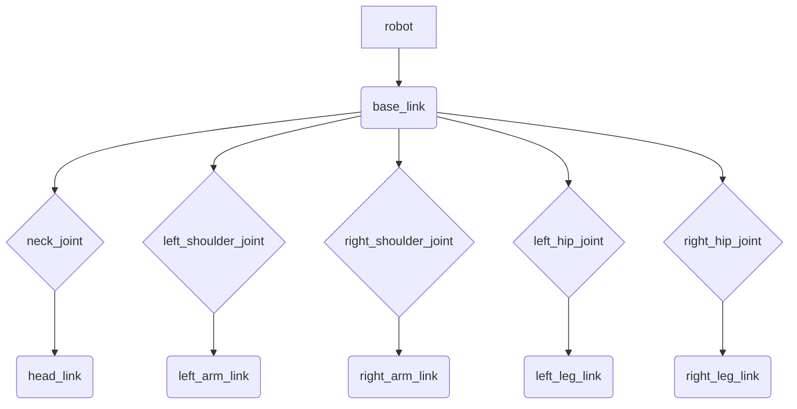

# URDF for Humanoids: Describing Your Robot's Kinematics and Sensors

The Unified Robot Description Format (URDF) is an XML-based file format used in ROS to describe all aspects of a robot. It's crucial for visualizing robots in simulation (e.g., RViz), performing kinematics, dynamics calculations, and interacting with planning and control libraries. For humanoid robots, URDF allows us to precisely define their complex structure, including many links (body parts), various types of joints, and integrated sensors.

## 1. Understanding URDF Structure

A URDF file consists of `<robot>` tags containing a collection of `<link>` and `<joint>` elements. Sensors and other elements are often defined as properties of links or as separate plugins.

**Basic URDF Elements:**
*   **`<robot name="robot_name">`**: The root element that encapsulates the entire robot description.
*   **`<link name="link_name">`**: Represents a rigid body segment of the robot. Links have visual, inertial, and collision properties.
    *   **`<visual>`**: Defines the appearance of the link (geometry, color, texture).
    *   **`<collision>`**: Defines the collision properties of the link (geometry, origin).
    *   **`<inertial>`**: Defines the mass, center of mass, and inertia tensor of the link.
*   **`<joint name="joint_name" type="joint_type">`**: Connects two links, defining their relative motion.
    *   **`type`**: Specifies the joint type (e.g., `revolute`, `continuous`, ``prismatic`, `fixed`, `floating`, `planar`). For humanoids, `revolute` (revolving around an axis) and `fixed` (no motion) are common.
    *   **`<parent link="parent_link_name">`**: Specifies the parent link.
    *   **`<child link="child_link_name">`**: Specifies the child link.
    *   **`<origin xyz="x y z" rpy="roll pitch yaw">`**: Defines the transformation from the parent link's origin to the child link's origin.
    *   **`<axis xyz="x y z">`**: For revolute/prismatic joints, defines the axis of motion.
    *   **`<limit>`**: Defines the joint's movement limits (effort, velocity, lower, upper).
    *   **`<dynamics>`**: Defines friction and damping.

## 2. Defining a Simple Humanoid Robot

Let's consider a simplified humanoid robot. It might have a `base_link` (torso), `head_link`, `left_arm_link`, `right_arm_link`, `left_leg_link`, and `right_leg_link`. These would be connected by `neck_joint`, `shoulder_joint`, `hip_joint`, etc.

**Diagram: Simplified Humanoid URDF Structure**


### Example URDF Snippet (for a neck joint)

```xml
<?xml version="1.0"?>
<robot name="simple_humanoid">
  <link name="base_link">
    <visual>
      <geometry><box size="0.2 0.4 0.6"/></geometry>
      <material name="blue"><color rgba="0 0 1 1"/></material>
    </visual>
    <inertial>
      <mass value="10.0"/>
      <origin xyz="0 0 0.3"/>
      <inertia ixx="1.0" ixy="0.0" ixz="0.0" iyy="1.0" iyz="0.0" izz="1.0"/>
    </inertial>
    <collision>
      <geometry><box size="0.2 0.4 0.6"/></geometry>
    </collision>
  </link>

  <link name="head_link">
    <visual>
      <geometry><sphere radius="0.15"/></geometry>
      <material name="red"><color rgba="1 0 0 1"/></material>
    </visual>
    <inertial>
      <mass value="2.0"/>
      <origin xyz="0 0 0"/>
      <inertia ixx="0.1" ixy="0.0" ixz="0.0" iyy="0.1" iyz="0.0" izz="0.1"/>
    </inertial>
    <collision>
      <geometry><sphere radius="0.15"/></geometry>
    </collision>
  </link>

  <joint name="neck_joint" type="revolute">
    <parent link="base_link"/>
    <child link="head_link"/>
    <origin xyz="0 0 0.7" rpy="0 0 0"/> <!-- Position head above base_link -->
    <axis xyz="0 0 1"/> <!-- Rotate around Z-axis (yaw) -->
    <limit lower="-1.57" upper="1.57" effort="100" velocity="10"/>
  </joint>

  <!-- More links and joints for arms, legs would follow -->

</robot>
```

## 3. Integrating Sensors in URDF

Sensors are typically described using `<link>` elements and `fixed` joints to attach them to the robot's body. ROS 2 then uses Gazebo plugins or other software interfaces to simulate or read data from these sensors.

**Common Sensors in Humanoid Robotics:**
*   **Cameras**: For vision, object detection, SLAM.
*   **LiDAR/Depth Sensors**: For environmental mapping, obstacle avoidance.
*   **IMUs (Inertial Measurement Units)**: For orientation, acceleration, and angular velocity (crucial for balance).
*   **Force-Torque Sensors**: For measuring interaction forces, especially in manipulation.

**Example: Adding a Camera Sensor**

A camera could be attached to the `head_link` using a `fixed` joint. The actual camera properties (FOV, resolution) would typically be defined in a Gazebo plugin referenced in the URDF or a separate `.gazebo` XML file.

```xml
  <link name="camera_link">
    <visual>
      <geometry><box size="0.02 0.05 0.02"/></geometry>
      <material name="black"><color rgba="0 0 0 1"/></material>
    </visual>
  </link>

  <joint name="camera_joint" type="fixed">
    <parent link="head_link"/>
    <child link="camera_link"/>
    <origin xyz="0.05 0 0.1" rpy="0 0 0"/> <!-- Offset from head -->
  </joint>

  <!-- Gazebo plugin for camera would be in a separate .gazebo XML or directly in URDF -->
  <!-- Example of a Gazebo plugin within URDF: -->
  <gazebo reference="camera_link">
    <sensor name="camera" type="camera">
      <visualize>true</visualize>
      <update_rate>30.0</update_rate>
      <camera>
        <horizontal_fov>1.047</horizontal_fov>
        <image>
          <width>640</width>
          <height>480</height>
          <format>R8G8B8</format>
        </image>
        <clip>
          <near>0.1</near>
          <far>100</far>
        </clip>
        <noise>
          <type>gaussian</type>
          <mean>0.0</mean>
          <stddev>0.007</stddev>
        </noise>
      </camera>
      <plugin name="camera_controller" filename="libgazebo_ros_camera.so">
        <ros>
          <namespace>/camera</namespace>
          <argument>--ros-args -r __ns:=/my_camera</argument>
          <remapping>image_raw:=image</remapping>
          <remapping>camera_info:=camera_info</remapping>
        </ros>
        <alwaysOn>true</alwaysOn>
        <updateRate>30.0</updateRate>
        <cameraName>simple_camera</cameraName>
        <imageTopicName>image_raw</imageTopicName>
        <cameraInfoTopicName>camera_info</cameraInfoTopicName>
        <frameName>camera_link_optical</frameName>
      </plugin>
    </sensor>
  </gazebo>
```

## 4. Visualizing URDF in RViz2

RViz2 is a 3D visualization tool for ROS 2. It allows you to visualize the robot model, sensor data, and planning output.

To display your URDF:
1.  Ensure you have `urdf_tutorial` and `rviz2` installed (`sudo apt install ros-<distro>-urdf-tutorial ros-<distro>-rviz2`).
2.  Launch `rviz2`.
3.  Add a `RobotModel` display and set its `Description Source` to `File` and `Description File` to your URDF path.
4.  Add a `Joint State Publisher` to manipulate joints, or `Robot State Publisher` if using ROS 2 nodes.

## Conclusion

URDF is an indispensable tool for describing robotic systems in ROS 2. For humanoids, it allows for the detailed modeling of their complex kinematic chains and the integration of diverse sensors, forming the digital blueprint for both simulation and real-world deployment. Mastering URDF is a foundational step towards building and controlling sophisticated humanoid robots.

## References

*   Open Robotics. (2023). *URDF Overview*. Retrieved from https://docs.ros.org/en/humble/Tutorials/URDF/URDF-Overview.html
*   Open Robotics. (2023). *URDF Examples*. Retrieved from https://wiki.ros.org/urdf/Examples
*   Open Robotics. (2023). *Gazebo ROS Packages*. Retrieved from https://github.com/ros-simulation/gazebo_ros_pkgs